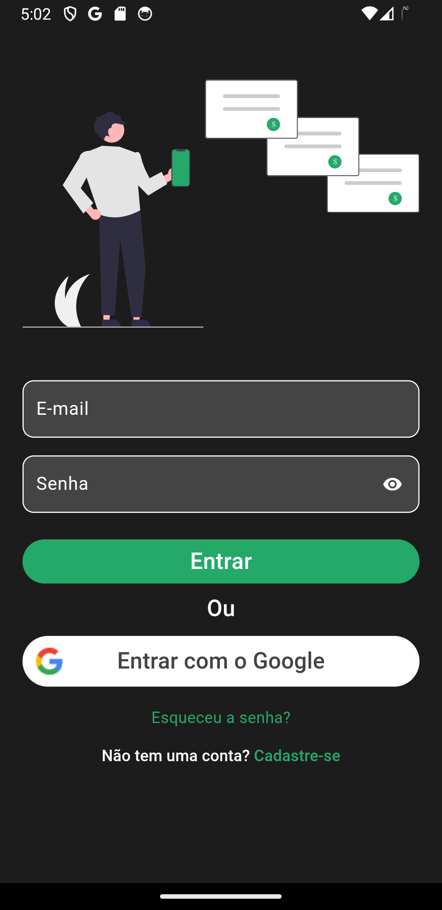
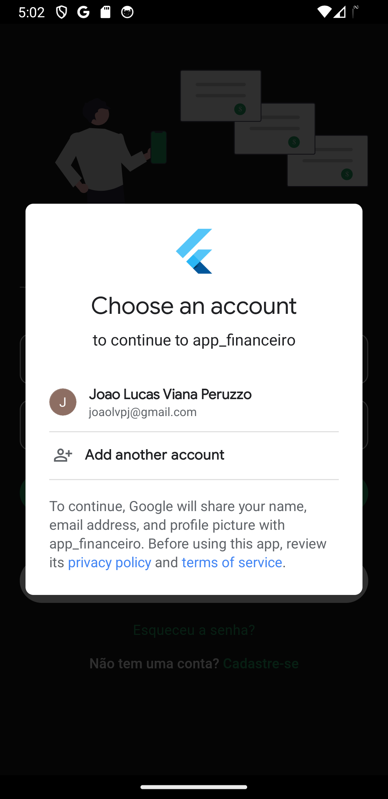
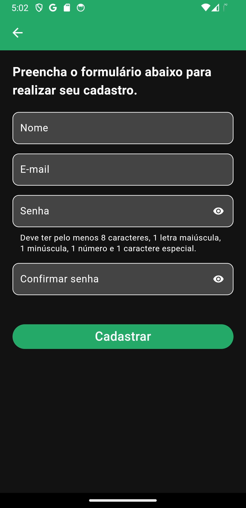
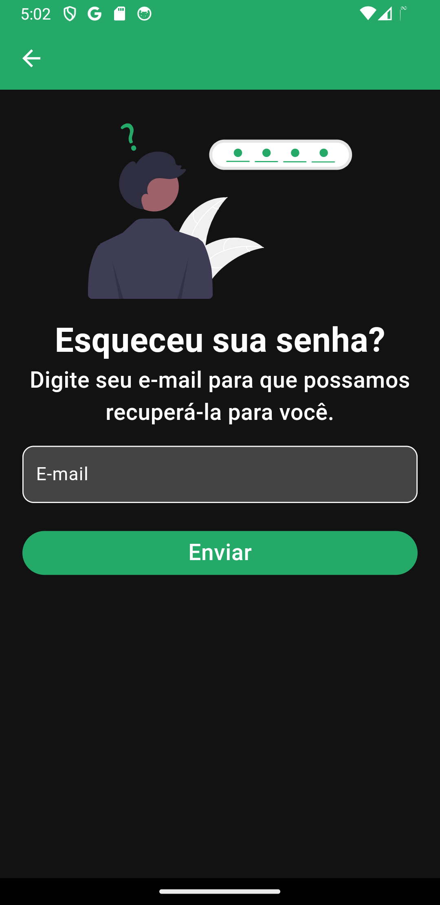
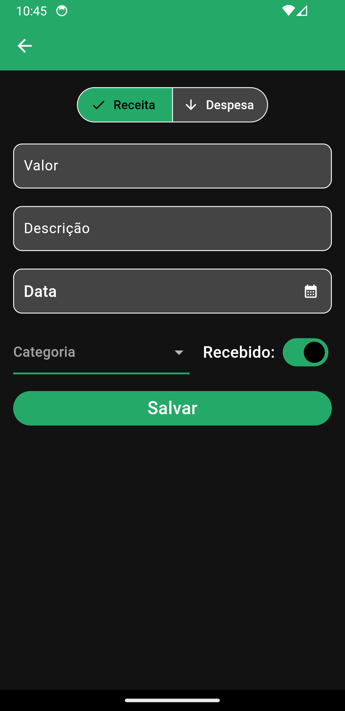

# App Financeiro

App criado com objetivo de gerenciar finanças pessoais.

## Autenticação
Módulo de autenticação completo.

## Home

Tela inicial exibindo saldo total, receitas e despesas no card, uma lista de transações recentes e o botão para incluir receitas ou despesas.

## Carteira

Tela exibindo gráfico de receitas e despesas e historico mensal de inclusões. 

## Profile
Tela de perfil com todas as opções disponíveis.

## 🔗 Contatos

